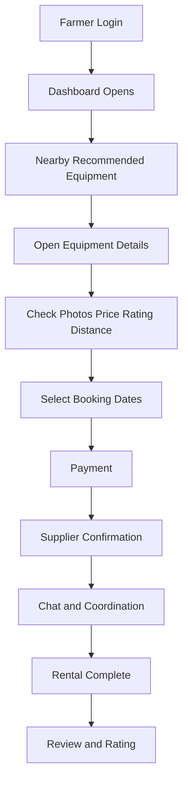

# 🚜 Farm Equipment Rental System

<div align="center">

### Smart Marketplace for Farmers to Rent Nearby Agricultural Machinery

**Problem Driven • Location Aware • Real-Time Booking • Trust Based Ratings**

</div>

---

## ✨ Overview

Small and medium farmers often face a major challenge: **farm machinery is expensive to buy and difficult to rent on time**. During urgent farming seasons, delays in getting tractors, harvesters, or seeders can directly reduce crop productivity.

This project solves that real-world problem by providing a **digital rental marketplace** where farmers can instantly discover **nearby available equipment**, compare ratings, check pricing, chat with suppliers, and complete secure bookings.

---

## 🚨 Problem We Solved

> Farmers struggle to access costly machinery when they need it most.

### Traditional Problems

* ❌ No trusted rental platform
* ❌ Nearby machine discovery is difficult
* ❌ Manual phone-call based booking
* ❌ No transparent price comparison
* ❌ No review or trust system
* ❌ Idle machinery remains unused

---

## 💡 Our Solution

The **Farm Rent App** connects **Farmers (Renters)** with **Equipment Owners (Suppliers)**.

### Key Solution Points

* 📍 Nearby machines shown first
* ⭐ Ratings for product, supplier, and renter
* 💬 Real-time chat before booking
* 📅 Availability-aware booking flow
* 💳 Secure online payment support
* 📈 Dynamic pricing logic
* 🎯 Recommendation engine based on distance + popularity

---

## 🖼️ Application Screens Preview

> Replace these with your Google Drive image links

| Screen                | Preview Link       |
| --------------------- | ------------------ |
| 🏠 Landing Page       | [Add G-Drive Link] |
| 🔐 Login / Signup     | [Add G-Drive Link] |
| 📍 Nearby Dashboard   | [Add G-Drive Link] |
| 🚜 Equipment Details  | [Add G-Drive Link] |
| 📅 Booking Page       | [Add G-Drive Link] |
| 💬 Chat Module        | [Add G-Drive Link] |
| 📊 Supplier Dashboard | [Add G-Drive Link] |

---

## 🌊 Complete Working Flow



---

## 👨‍🌾 Farmer Journey

```text
Login → Dashboard → Nearby Machines → Filter/Search → Details → Booking → Payment → Chat → Review
```

## 👨‍🔧 Supplier Journey

```text
Login → Add Equipment → Upload Photos → Set Price → Manage Availability → Approve Booking → Chat → Earn Revenue
```

---

## 🧩 Feature Modules

### 🔐 Authentication

* JWT Authentication
* Protected Routes
* Role-Based Access
* Secure Sessions

### 🚜 Equipment Listing

* Multi-image uploads
* Category wise listing
* Engine / non-engine attributes
* Condition and specs
* Pricing per hour/day

### 📍 Smart Search

* Nearby-first ranking
* Rating-based sorting
* Popular equipment recommendation
* Hybrid search + filters

### 📅 Booking System

* Date availability checks
* Rental duration calculation
* Auto pricing
* Booking history
* Cancellation support

### ⭐ Trust Layer

* Product ratings
* Supplier ratings
* Renter ratings
* Verified booking reviews

### 💬 Communication

* Real-time chat
* Negotiation support
* Delivery timing discussion

---

## 🧠 Recommendation Logic

```text
Recommendation Score = Distance + Product Rating + Supplier Rating + Popularity + Availability
```

### Priority Rules

1. 📍 Nearest machine first
2. ⭐ Higher ratings next
3. 🔥 Frequently booked equipment boosted
4. ✅ Available now gets top priority

---

## 🗄️ Database Design

### 👤 Users

* userId
* name
* role
* email
* phone
* location
* ratings

### 🚜 Equipment

* equipmentId
* ownerId
* title
* images
* category
* price
* location
* specs
* ratings

### 📅 Bookings

* bookingId
* renterId
* supplierId
* equipmentId
* startDate
* endDate
* paymentStatus
* bookingStatus

### 💬 Chat

* senderId
* receiverId
* bookingId
* message
* timestamp

---

## 🏗️ Tech Stack

| Layer        | Technologies                    |
| ------------ | ------------------------------- |
| 🎨 Frontend  | React.js, Tailwind CSS, Zustand |
| ⚙️ Backend   | Node.js, Express.js             |
| 🗄️ Database | MongoDB                         |
| 🔐 Security  | JWT, Bcrypt                     |
| 💬 Real Time | Socket.io                       |
| ☁️ Media     | Cloudinary                      |
| 💳 Payments  | Stripe / Razorpay               |
| 📍 Maps      | Geolocation API                 |

---

## 🚀 Future Scope

* 🤖 AI-based demand pricing
* 🌦️ Weather-aware recommendations
* 🗣️ Hindi voice search
* 📲 WhatsApp chatbot integration
* 🌾 Crop-specific equipment suggestions
* 📈 Demand heatmaps

---

## 📈 Impact

* 🌾 Reduced machinery cost for farmers
* 💰 Better income for suppliers
* 📍 Faster local discovery
* 🤝 Trust-driven rural rental ecosystem
* 🚜 Better equipment utilization

---

## 🔗 Links


* 🌐 Live Demo: https://farm-rent-app-12.onrender.com
* 🖼️ Screenshots Folder: https://drive.google.com/drive/folders/1e2BsY5opSCfluCrTjOt9wwFqRUWu-ZED?usp=sharing

---

## 👨‍💻 Author

### Rohan Mishra

**Full Stack Developer | MERN | System Design | Rural Tech Innovation**
